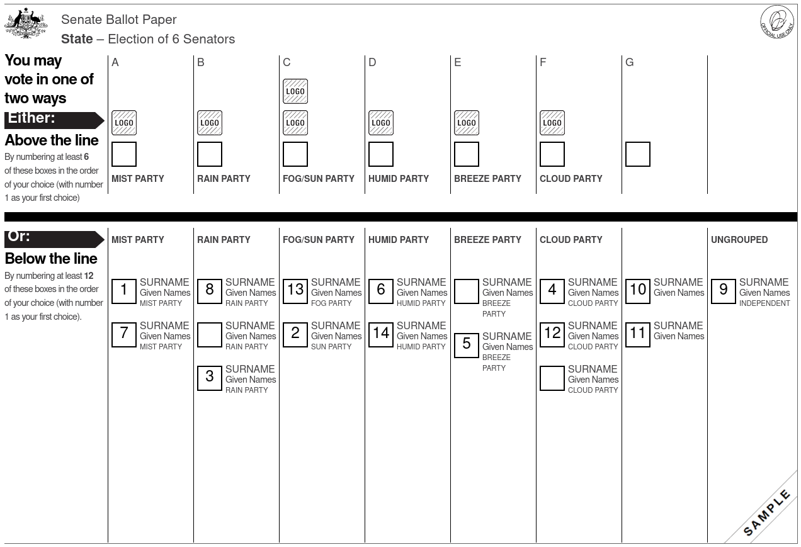
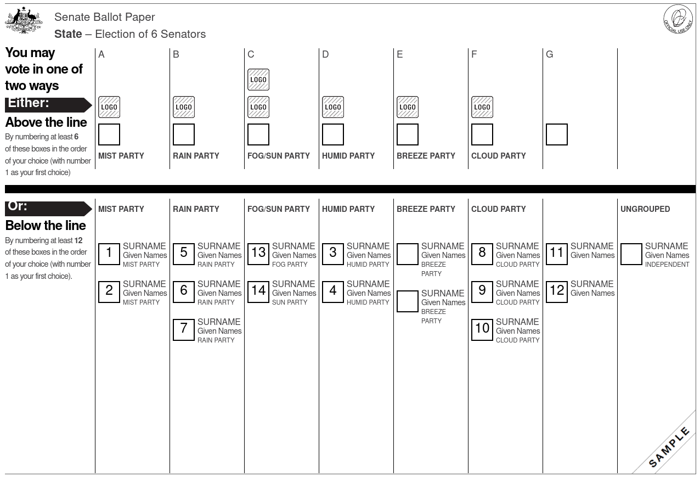

# How Senators are elected

> 2022-05-14

## Introduction

Just as with the House of Representatives, Australia uses preferential voting to elect Senators, but
our votes are counted using a different mechanism that gets us [proportional representation]. In
this blog post, we're going to learn how to fill out a Senate ballot, and how our Senate ballots are
counted.

This article is mostly independent of political opinion. Where opinion creeps in, it will be
explicitly flagged as such, like below:

> **Opinion:** Kangaroo is tastier than beef.

If you haven't read [How voting for your House of Representatives Member works][article1], then
please give that a read first: we'll be making references to that often.

Before making this article publicly available, I asked [Kevin Bonham], a [psephologist], to review
it, and provide commentary on any inaccuracies so that they might be fixed. **Although they haven't
officially approved the content**, with their input, I am confident that it's an accurate
representation of our voting system. However, you should trust all communication by the Australian
Electoral Commission (AEC) above what you read here.

In this post, we'll discuss:

1. Why we can't use the same counting method in both the House and Senate
2. Understanding the Senate ballot
3. Case Study
4. Who really does the preferencing (Senate edition)?

## Why we can't use the same counting method in both the House and Senate

When electing someone to the House of Representatives, there are multiple candidates running for one
seat that represents somewhere between 70 000 and 140 000 voters (AEC enrolment stats). There is
always exactly one winner, which means that we're able to find someone who accumulates more than
half the votes through successive rounds of elimination.

Unlike in the House, there are twelve Senators for each of the six states and two each for the ACT
and NT. In a normal election, we elect about half the Senators, so six for the states and two for
the constitutionally-recognised territories. When there's a [double dissolution], we need to elect a
whole new Senate. In this situation, the states need to have twelve winners, and the two territories
still have two winners. If we use the same method for the House as we do in the Senate, that means
that over half of the state would agree on one Senator, but what about the others?

To get around this problem, we employ a counting method called [single-transferable vote][stv] for
our Senators. **It's still a form of preferential voting**, but it enables us to determine multiple
winners instead of just one. This enables each State and Territory to have _proportional_
representation, which means that your vote contributes to electing all senators, not just one.

### Formal ballots and informal ballots (again)

As with the House of Representatives ballot, **provided you fill out your ballot paper according to
the rules, it's impossible for you to waste your vote**. Here are the _main_ rules again (in list
format):

* Number the boxes in the form of 1, 2, 3, .... Unlike with the House of Representatives, you don't
  need to number all of the boxes, but there are a minimum number of boxes that need to be numbered.
  More on that below.
* Make sure the boxes are clearly marked and easy to read. The [AEC provides us with pencils instead
  of pens to make sure that our results don’t smudge when writing or counting][pencils].
* Don't put any identifying information such as a name, address, date-of-birth, etc., on your ballot.
* Either vote above the thick black line, or below it, but don't do both.

We call a ballot paper that's followed all the rules a _formal_ ballot. **Only formal votes are
counted and contribute to the election result**. The AEC provides a [lengthy guide][formal]
outlining what constitutes formal and informal ballots and they also have a [practice mode][practice].

## Understanding the Senate ballot

The Senate ballot paper is white and looks like the sample ballot above. The thick black line
divides two separate ways of voting: we can either number the boxes above it, or we can number the
boxes below it: but we can't do both. There are also instructions to the left that tell you the
minimum number of boxes you need to number for your method.

When we vote Below the Line (BTL), we are voting for individual candidates, just like in the House
of Representatives. We can number the boxes however we want.

### Voting Below the Line

In this example, we can see that the voter has randomly numbered the boxes below the line, and has
even left some of the boxes blank. Because the instructions said to number "at least 12 boxes", and
the voter wrote in 14, their ballot is still formal.

**Voting below the line is the only way to vote for or give preferences to an UNGROUPED candidate.**

### Voting Above the Line

For convenience, we can also preference groups of candidates. Voting above the line tells the
counters to treat our ballot as if we had numbered the boxes below the line in ascending order for
the group. That means that the ballot just above this paragraph is exactly the same as the following
one!

This kind of voting is relatively new: it only came about in 2016. There was a different method for
Above the Line voting prior to the 2016 federal election. If you're a voter older than 24 and aren't
an election nerd like me, then this might come as a surprise. We'll talk more about this in the
preferencing section at the bottom.

**Remember: there's no way to vote for or give preferences to an UNGROUPED candidate when you vote Above the Line.**

## Case Study

**This section has a lot of numbers in tables. If you don't like numbers, you can [skip down to the
preferencing section](#Who-really-does-the-preferencing), so long as you're still doing preferential
voting**.

We're not going to use a real-world scenario in this case study due to the sheer length of the
process. In the [2019 federal election], here's how many rounds were necessary for each state:

| State | Senators to elect | Rounds |
|-------|-------------------|--------|
| NT    | 2                 | 1      |
| ACT   | 2                 | 25     |
| TAS   | 6                 | 139    |
| SA    | 6                 | 177    |
| WA    | 6                 | 231    |
| QLD   | 6                 | 288    |
| VIC   | 6                 | 367    |
| NSW   | 6                 | 429    |

The NT election isn't interesting because it happens too quickly, and the ACT has far too many
rounds in what's already, at this point, a long article. Fortunately, the AEC has a nice
[infographic] that covers the process for us with fewer rounds than the ACT, so we'll defer to that
for explaining the counting mechanism. We spend the rest of this section discussing how things work
and why. Everything in this section is derived from the AEC's official page, ['How the Senate result
is determined'][senate-result].

### Determining the minimum number of votes to get elected

The first thing we need to do is establish the minimum number of votes a candidate needs in order to
be elected. When there's only one vacancy, we just need more than half the total number of votes.
When there's multiple vacancies, we apply the formula `(number_of_voters / (vacancies + 1)) + 1`.
For the 2019 election, the quotas looked like this for each state:

| State | Senators to elect | Voters    | Formula               | Quota   |
|-------|-------------------|-----------|-----------------------|---------|
| NT    | 2                 | 105'027   | `(105'027 / 3) + 1`   | 35'010  |
| ACT   | 2                 | 270'231   | `(270'231 / 3) + 1`   | 90'078  |
| TAS   | 6                 | 351'988   | `(351'988) / 7 + 1`   | 50'285  |
| SA    | 6                 | 1'094'823 | `(1'094'823 / 7) + 1` | 156'404 |
| WA    | 6                 | 1'446'623 | `(1'446'623 / 7) + 1` | 206'661 |
| QLD   | 6                 | 2'901'464 | `(2'901'464 / 7) + 1` | 414'495 |
| VIC   | 6                 | 3'739'443 | `(3'739'443 / 7) + 1` | 534'207 |
| NSW   | 6                 | 4'695'326 | `(4'695'326 / 7) + 1` | 670'761 |

You might be wondering if it's fair that Senators running for the NT only need 35 010 votes, while
NSW needs a whopping 670 761. Remember that we're aiming for _proportional representation_ within
each state and territory. That not only means we want to have all voices heard for all vacancies,
but also that the number of votes required to get elected needs to increase with the number of
voters in the electorate.

### The counting process

#### Step 1: This is still preferential voting

Since this is still a form of preferential voting, we first allocate the votes into groups
corresponding to voters' first preferences. Any candidates who meet the quota are immediately
elected. The 2019 election saw at least one candidate immediately elected for each state (two in the
NT's case, which is why there was only one round).

#### Step 2: Transferring the surplus

Popular candidates, such as independents who are extraordinarily active within their community and
candidates for the louder parties, will probably end up with more votes than the necessary quota. As
we discussed above, that's not a good situation to be in when there are multiple candidates. To
ensure that proportional representation is achieved, if there's even a single vote over the quota
for a candidate, then we need to transfer that surplus to the second preference. There's a problem
though: whose ballots are considered to be a part of the "surplus"? I consider it natural that
almost everyone would want their vote to be included in the surplus that's transferred, but if we
transferred everyone's votes, then we're moving a lot more than the surplus!

Fortunately, there's a way to achieve this without moving more than the surplus' amount of votes.
Everyone's votes are transferred, but with a "voting power" to match the surplus. The formula
applied here is `voting_power = surplus / total_votes_for_candidate`. For example, if Candidate A
gets 1'000'000 votes, but the quota was only 500'000, that means that everyone who Voted 1 for A
will have their 2 Vote considered at half "strength".

Once we've moved everyone's votes over at the reduced "strength", we check to see if anyone has met
or exceeded the quota, and repeat if necessary. Votes with a reduced "strength" that contribute to
another surplus will have the same "strength" as a vote that's being transferred for the first time.
For example, if Candidate B had enough votes transferred so that they ended up with 750'000 votes,
and some of those votes were from the half-"strength" Candidate A transfer, then those votes will
have ⅓ "strength" for their 3 Vote, just like the people who Voted 1 for B's 2 Vote. The fairer
method would be for those 3 Votes to continue to weaken, meaning that they'd have ⅙ "strength" for
the 3 Vote and so on, but successive governments just haven't fixed this problem. [Antony Green
wrote about this in 2014][antony].

This process is repeated until there are no more surpluses, or until all the seats are filled.

#### Step 3: Candidate elimination

Once we end up in a situation where there are no more candidates who have reached the quota, we go
back to the rules of [single-seat preferential voting][article1]. That means that the unelected
candidate with the fewest votes is eliminated, and the votes allocated to them are redistributed to
the voters' second, third, etc., preference (depending on how far they travelled in the suprlus
stage). A key difference between Step 2 and Step 3 is that votes moved in Step 3 move with their
_current_ "voting power". For example, if Candidate C is eliminated, then everyone who Voted 1 for C
will have their votes moved at full "strength", while people who Voted 1 for A and 2 for C will have
their votes moved at half "strength".

We then jump back to Step 1 to repeat the process, until there are no more vacancies.

#### Corner case 1: What happens when counting gets to an empyty box?

Remember that we don't need to fill out all the boxes to have a formal Senate ballot: we just need
to fill in at least the minimum number of boxes for our voting method. That means many ballots are
probably going to have empty boxes after a while. Once your vote gets to that point, it means that
you've told the counters you no longer care who is elected, and your ballot will be set aside and
no longer participates in the process.

#### Corner case 2: What happens when there's still one or more vacancies and not enough ballots for anyone to meet the quota?

In this case, we still continue redistributing the ballots until we’re left with just two candidates.
The candidate with the majority of votes will be elected.

### Such a complex process! Why do we have it?

_Voting_ for Senators is as easy as voting for your local representative. It might be a bit lengthier,
but the rules remain exactly the same for voters. _Counting_, on the other hand, is more complicated,
but it ensures that it's impossible to waste your vote, and that your voice is heard as much as
possible.

> **Opinion:** The complexity of this method actually makes it one of the fairest voting systems in
> the world.

## Who really does the preferencing? (Senate edition) {#Who-really-does-the-preferencing}

The rules for Senate voting changed at some point in 2016, prior to the federal election that year.
That means that if you're over the age of 24, you might be familiar with the concept of _Group
Voting Tickets_. **Group Voting Tickets have been abolished at the federal level**, and also at the
state level for NSW, SA, and WA. That means in the upcoming federal election, **there are no
preference deals among parties** and parties without sufficient votes to meet a quota **cannot give
your vote away**.

Parties can provide How-to-Vote cards, which is about the closest thing we've got to "preference
deals", but it's merely a **recommendation** on their part. For example, if the sample ballot above
had run in an election, there would have been a maximum of 8 How-to-Vote cards: one for each group
above the line, and one for each ungrouped candidate. There are over **966 trillion** different ways
to cast a formal vote on that ballot! If you don't want to follow a How-to-Vote card, you can simply
refuse them or put them in the bin.

Just as when voting for your local representative, **only you decide your vote.** Anyone telling you
otherwise is spreading a myth from a bygone era of Australian history.

## Conclusion

In this blog, we saw that voters get to vote in the same way on both ballots (but don't need to
number all of the boxes), that the counting process is very involved (but also very fair), and that
**only you decide your vote**. Please share this with your friends and family to ensure that they
understand our wonderful voting system.

If the article is popular enough, I'll write a third one to talk about how to _maximise_ your vote.

[2019 federal election]: https://results.aec.gov.au/24310/Website/SenateResultsMenu-24310.htm
[AEC enrolment stats]: https://www.aec.gov.au/Enrolling_to_vote/Enrolment_stats/national/2022-fe.htm
[antony]: https://www.abc.net.au/news/2014-12-16/transfer-values-in-northern-victoria-region/9388532
[article1]: preferential-voting.md
[double dissolution]: https://www.aph.gov.au/About_Parliament/Parliamentary_Departments/Parliamentary_Library/pubs/BN/0910/DoubleDissolutions
[formal]: https://www.aec.gov.au/elections/candidates/files/ballot-paper-formality-guidelines.pdf
[infographic]: https://www.aec.gov.au/voting/counting/files/senate-count-process.pdf
[Kevin Bonham]: https://www.blogger.com/profile/06845545257440242894
[pencils]: https://www.aec.gov.au/faqs/polling-place.htm
[practice]: https://www.aec.gov.au/voting/how_to_vote/practice/practice-senate.htm
[proportional representation]: https://en.wikipedia.org/wiki/Proportional_representation
[psephologist]: https://en.wikipedia.org/wiki/Psephology
[Scrutineers]: https://www.google.com/url?q=https://www.aec.gov.au/elections/candidates/scrutineers-handbook/&sa=D&source=docs&ust=1651106665328611&usg=AOvVaw2skX1iy2JAYjHvmICDh4rL
[senate-result]: https://www.aec.gov.au/voting/counting/senate_count.htm
[stv]: https://en.wikipedia.org/wiki/Single_transferable_vote
